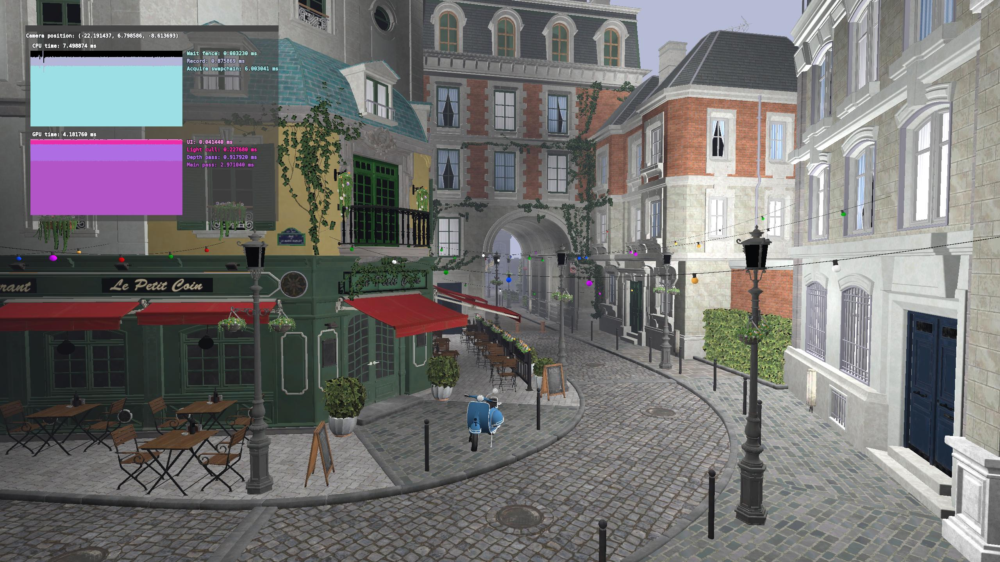

# vull

A vulkan rendering engine written in C++ 20.

## Dependencies

* [freetype](https://freetype.org)
* [harfbuzz](https://github.com/harfbuzz/harfbuzz)
* [libpng](https://github.com/glennrp/libpng) (for vpak tool)
* [meshoptimizer](https://github.com/zeux/meshoptimizer) (for vpak tool)
* [shaderc](https://github.com/google/shaderc) (for offline shader compilation step)
* [simdjson](https://github.com/simdjson/simdjson) (for vpak tool)
* [stb_dxt](https://github.com/nothings/stb) (for vpak tool)
* [xcb](https://xcb.freedesktop.org)
* [zstd](https://github.com/facebook/zstd)

## Requirements

* Vulkan 1.3
* VK_EXT_descriptor_buffer
* VK_EXT_shader_atomic_float
* VK_EXT_shader_atomic_float2

## Building and running

Vull uses [cmake](https://cmake.org) as its build system. Either `make` or `ninja` will additionally be needed. Windows
is not currently supported.

### Installing dependencies and tools

#### Gentoo

    emerge -n \
     app-arch/zstd \
     dev-util/cmake \
     dev-util/ninja \
     media-libs/freetype \
     media-libs/harfbuzz \
     media-libs/libpng \
     media-libs/shaderc \
     media-libs/vulkan-layers \
     media-libs/vulkan-loader \
     x11-libs/libxcb \
     x11-libs/xcb-util

Note that meshoptimizer and simdjson are always linked to via `FetchContent`, and `std_dxt` is vendored. The vulkan
validation layers (`vulkan-layers`) are not required but are extremely useful for development.

### Configuring CMake

To configure vull, use:

    cmake . \
     -Bbuild \
     -DCMAKE_BUILD_TYPE=Release \
     -DVULL_BUILD_SANDBOX=ON \
     -GNinja

#### Available options

| Option                | Description                          | Default Value |
|-----------------------|--------------------------------------|---------------|
| `VULL_BUILD_GLTF`     | Build vpak tool with glTF support    | `OFF`         |
| `VULL_BUILD_SANDBOX`  | Build sandbox application            | `ON`          |
| `VULL_BUILD_TESTS`    | Build tests                          | `OFF`         |
| `VULL_BUILD_WARNINGS` | Build with compiler warnings enabled | `OFF`         |

### Building

    cmake --build build

### Running

Depending on the options passed to CMake, five executables can be produced after building:

* `./build/engine/vull-tests`
* `./build/sandbox/vull-sandbox`
* `./build/tools/vpak`
* `./build/tools/vsi`
* `./build/tools/vslc`
